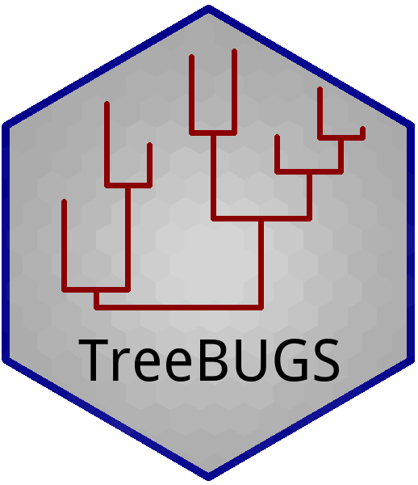

[](https://cran.r-project.org/package=TreeBUGS)
[](https://github.com/danheck/TreeBUGS/actions/workflows/check-standard.yaml)

[](https://cranlogs.r-pkg.org/badges/TreeBUGS)
[](https://cranlogs.r-pkg.org/badges/grand-total/TreeBUGS)


# TreeBUGS



TreeBUGS is an R package that facilitates using hierarchical multinomial processing tree (MPT) models that are often used in cognitive psychology (Erdfelder et al., 2009). 
Specifically, TreeBUGS implements the Bayesian estimation via MCMC sampling for the Beta-MPT (Smith & Batchelder, 2010), the latent-trait MPT model (Klauer, 2010), and standard (fixed-effects) MPT models.

## General Approach of Using TreeBUGS

In the most simple user scenario, the following steps are required:

1. Define path to existing MPT model file in .eqn format (cf. multiTree; Moshagen, 2010)
2. Define path to data set with individual frequencies (.csv file: comma separated, rows=persons, columns=labeled categories)
3. Call `betaMPT` or `traitMPT` (exact code in manual/vignette)
4. Check convergence of MCMC chains
5. Summarize and plot results using functions tailored to MPT models

These steps are explained in more detail in the package vignette, which can be opened in R by typing `vignette("TreeBUGS")`. 


## Tutorial on MPT Modeling

A tutorial paper on multinomial processing tree models (including hierarchical model fitting with TreeBUGS) can be found here:

- Schmidt, O., Erdfelder, E., & Heck, D. W. (2023). How to develop, test, and extend multinomial processing tree models: A tutorial. *Psychological Methods*. https://doi.org/10.1037/met0000561 (Preprint: https://psyarxiv.com/gh8md/)


## Installing TreeBUGS

TreeBUGS requires the software [JAGS](https://mcmc-jags.sourceforge.io/). 
To install the latest release of TreeBUGS from [CRAN](https://cran.r-project.org/web/packages/TreeBUGS), type the following into the R console:
```r
install.packages("TreeBUGS")
```

To install the latest developer version of TreeBUGS from GitHub, run:
```r
### Dependencies:
install.packages(c("devtools", "coda", "runjags", "hypergeo", "testthat",
                   "rjags", "Rcpp", "RcppArmadillo", "logspline"))
devtools::install_github("danheck/TreeBUGS", build_vignettes = TRUE)
```

To compile C++ code, Windows and Mac require 
[Rtools](https://cran.r-project.org/bin/windows/Rtools/) and 
[Xcode Command Line Tools](https://www.maketecheasier.com/install-command-line-tools-without-xcode/), respectively. 
Moreover, on Mac, it might be necessary to install the library `gfortran` manually by typing the following into the console 
([required to compile the package `RcppArmadillo`](http://thecoatlessprofessor.com/programming/rcpp-rcpparmadillo-and-os-x-mavericks-lgfortran-and-lquadmath-error/)):

```
curl -O http://r.research.att.com/libs/gfortran-4.8.2-darwin13.tar.bz2
sudo tar fvxz gfortran-4.8.2-darwin13.tar.bz2 -C /
```


## Citation

If you use TreeBUGS, please cite the software as follows:

- Heck\*, D. W., Arnold\*, N. R., & Arnold, D. (2018). 
TreeBUGS: An R package for hierarchical multinomial-processing-tree modeling. 
*Behavior Research Methods, 50*, 264-284. 
https://doi.org/10.3758/s13428-017-0869-7


## References

* Batchelder, W. H., & Riefer, D. M. (1999). 
Theoretical and empirical review of multinomial process tree modeling. 
*Psychonomic Bulletin & Review, 6*, 57–86. 
https://doi.org/10.3758/BF03210812

* Erdfelder, E., Auer, T.-S., Hilbig, B. E., Assfalg, A., Moshagen, M., & Nadarevic, L. (2009). 
Multinomial processing tree models: A review of the literature. 
*Journal of Psychology, 217*, 108–124. 
https://doi.org/10.1027/0044-3409.217.3.108

* Klauer, K. C. (2010). 
Hierarchical multinomial processing tree models: A latent-trait approach. 
*Psychometrika, 75*, 70–98. 
https://doi.org/10.1007/s11336-009-9141-0

* Matzke, D., Dolan, C. V., Batchelder, W. H., & Wagenmakers, E.-J. (2015). 
Bayesian estimation of multinomial processing tree models with heterogeneity in participants and items. 
*Psychometrika, 80*, 205–235. 
https://doi.org/10.1007/s11336-013-9374-9

* Moshagen, M. (2010). 
multiTree: A computer program for the analysis of multinomial processing tree models. 
*Behavior Research Methods, 42*, 42–54. 
https://doi.org/10.3758/BRM.42.1.42

* Smith, J. B., & Batchelder, W. H. (2010). 
Beta-MPT: Multinomial processing tree models for addressing individual differences. 
*Journal of Mathematical Psychology, 54*, 167–183. 
https://doi.org/10.1016/j.jmp.2009.06.007
